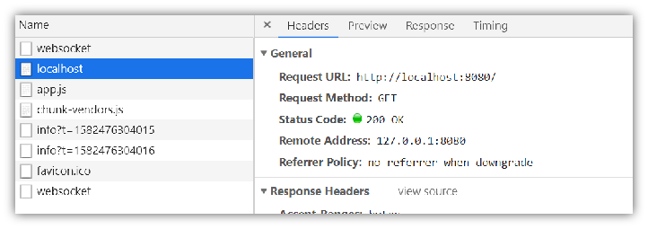
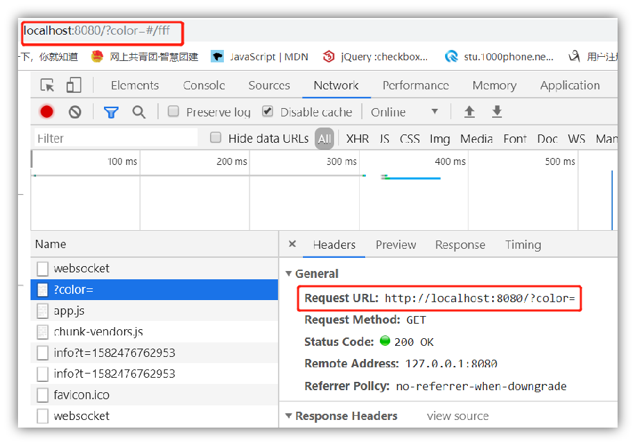
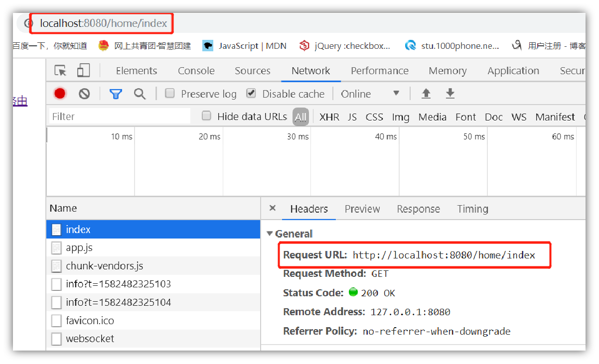

# 在vue-router中hash和history路由的区别

## 一、hash模式及其原理

### 1、简介

早期的前端路由的实现就是基于 location.hash 来实现的。其实现原理很简单，location.hash 的值就是 URL 中 # 后面的内容。比如下面这个网站，它的 location.hash 的值为 ‘#/home/index ‘：http://localhost:8080/#/home/index。


URL 中 hash 值只是客户端的一种状态，也就是说当向服务器端发出请求时，hash 部分不会被发送。

hash 值的改变，都会在浏览器的访问历史中增加一个记录。因此我们能通过浏览器的回退、前进按钮控制hash 的切换。

### 2、hash值的切换方法

#### (1) vue-router

`<router-link to="/home/index">vue点击跳转home</router-link>`

`<router-link to="/about/index">vue点击跳转about</router-link>`

#### (2) a标签

`<a href="#/home/index">点击跳转home</a>`

`<a href="#/about/index">点击跳转about</a>`

#### (3) 通过js对location.hash进行赋值

`location.hash = "#/home/index"; `

`location.hash = "#/about/index";`

### 3、通过#来了解hash

#### （1）“#”代表网页中的一个位置

其右边的字符，就是该位置的标识符。比如：http: // localhost /#/home/index就代表网页index.html的/home/index位置。浏览器读取这个URL后，会自动将/home/index位置滚动至可视区域。（单页应用）

为网页位置指定标识符，有两种方法：

使用锚点：`<a name="/home/index">home</a>`

使用id属性：`<div id="/about/index">about</div>`

#### （2）改变“#”不会触发网页重载

单单改变#后的部分，浏览器只会滚动到相应的位置，不会重新加载页面

简单模拟单页面应用跳转

```
<!DOCTYPE>

<html>
  <head>
    <meta http-equiv="Content-Type" content="text/html;charset=UTF-8" />

    <title>尝试锚点</title>
  </head>

  <body>
    <ul>
      <li><a href="#/home/index">点击跳转home</a></li>

      <li><a href="#/about/index">点击跳转about</a></li>
    </ul>

    <!--设置锚点方法2-->
    <a name="/home/index">home</a>

    <p>奥特曼</p>
    <p>奥特曼</p>
    <p>奥特曼</p>
    <p>奥特曼</p>
    <p>奥特曼</p>
    <p>奥特曼</p>
    <p>奥特曼</p>
    <p>奥特曼</p>

    <div id="/about/index">about</div>

    <p>打怪兽</p>
    <p>打怪兽</p>
    <p>打怪兽</p>
    <p>打怪兽</p>
    <p>打怪兽</p>
    <p>打怪兽</p>
    <p>打怪兽</p>
    <p>打怪兽</p>
  </body>
</html>

```

#### （3）HTTP请求不包括“#”

“#”是用来知道浏览器动作的，对服务端完全无用。所以，HTTP请求中不包括#。

比如访问这个网址：http://localhost:8080/#/home/index

浏览器实际发出的请求是这样的：



可以看到，只是请求index.html，根本没有“#/home/index”的部分

#### （4）在第一个“#”后面出现的任何字符串，都会被浏览器解读为位置标识符

也就是意味着，这些字符串都不会被发送到服务端

比如，这个URL愿意是指定一个颜色值：http://localhost:8080/?color=#fff

但是，浏览器实际发出的请求是：

可以看到，“#fff”被省略了。只有将#转码为%23，浏览器才会将其作为实义字符串处理。

也就是说，上面的网址应该被写成：http://localhost:8080/?color=%23fff

#### （5）window.location.hash

window.location.hash这个属性可读可写，在读取和写入时都会识别#后面的值

读取时，可以用来判断网页状态是否改变。


写入时，会在不重载网页的前提下，创在一条访问历史记录。如：

`window.location.hash = "#/home/index"; `

#### （6）onhashchange

这是一个HTML5新增的时间，当#值发生变化时，就会触发这个时间。IE8+、Firefox3.6+、Chrome5+、Safair4.0+支持该事件。

它的使用方法有三种：

```
window.onhashchange = fn
<body onhashchange="fn()">
window.addEventListener("hashchange", fn, false);
```

### 4、hash路由的核心—hashchange事件

hashchange ( vue中 )

```
export default {
  created() {
    window.addEventListener("hashchange", this.eventTrigger, false);
  },
  destroyed() {
    window.removeEventListener("hashchange", this.eventTrigger, false);
  },
  methods: {
    eventTrigger(event) {
      console.log("%cevent.oldURL", "background: blue; color: white", event.oldURL);
      console.log("%cevent.newURL", "background: grey; color: white", event.newURL);
      if (event.newURL.match(/\#(\/home\/index)?/)[0] === "#/home/index") {
        alert("进入到指定页面");
      }
    }
  }
};
```

根据这个特性，通过HashChangeEvent的oldURL和newURL方法可以实现当通过后退重新进入某个页面时进行二次跳转或者页面刷新等操作。

通过a标签或者通过location.hash方法改变路由的方式中，可以使用 hashchange 事件来监听 hash 值的变化，从而直接对于页面进行操作。

```diff
- vue 2.8.0 以上；vue 触发的 hash 改变，不会触发 hashchage 事件
```
所以可以在created或者mounted加入以下代码查看具体的效果

```
    // this.$router.push("#/index");
    // this.$router.go(-1);
```

### 5、简单实践

定位第一个进入的页面

App.vue

```
    // 为第一个路由添加一个传参
    if (!Object.keys(this.$route.query).length) {
      this.$router.push(`${location.hash.slice(1)}?page=first`);
    } else if (!Object.keys(this.$route.query).includes("page")) {
      this.$router.push(`${location.hash.slice(1)}&page=first`);
    }
```

main.js

```
let firstPath = ""

router.beforeEach((to, from, next) => {
  if (to.query.page === "first") {
    firstPath = to.path
    console.log("匹配当前路由", firstPath);
    next(true);
  } else if (to.path === firstPath && from.query.page === "first") {
    console.log('禁止页面后退')
    next(false);
  } else {
    next(true)
  }
});
```

## 二、history模式及其原理

### 1、简介

随着history Api的到来，前端路由开始进化，相比较hash，history Api给了前端完全的自由。

总的来说history Api共有两种方法：

#### （1）切换

```
history.go(-2);	//后退两次
history.go(2);		//前进两次
history.back(); 	//后退
hsitory.forward(); 	//前进
```

#### （2）修改

```
// 向当前历史栈内最上方添加一条记录
history.pushState(stateObj, "page 1", "/home/index");

// 替换当前历史栈最上方的一条记录
history.replaceState(stateObj, "page 1", "/home/index");
```

### 2、history的原理及简单实现

本地文件打开可能会有跨域，借用了vue的服务器

```
<template>
  <div>
    <ul id="menu">
      <li>
        <a href="/test/index">首页</a>
      </li>
      <li>
        <a href="/test/news">资讯</a>
      </li>
      <li>
        <a href="/test/user">个人中心</a>
      </li>
    </ul>

    <div id="history"></div>
  </div>
</template>

<script>
function preventA(e) {
  if (e.target.nodeName.toLowerCase() === 'a') {
    e.preventDefault();

    //获取超链接的href，改为pushState跳转，不刷新页面
    let path = e.target.getAttribute('href');

    //修改浏览器中显示的url地址
    window.history.pushState({ key: '' }, null, path);

    //根据path，更改页面内容
    render(path);
  }
}

function goBack(e) {
  render(location.pathname);
}

function render(path) {
  let history = document.getElementById('history');
  switch (path) {
    case '/test/index':
      history.innerHTML = '<h1>这是首页内容</h1>';
      break;
    case '/test/news':
      history.innerHTML = '<h1>这是新闻内容</h1>';
      break;
    case '/test/user':
      history.innerHTML = '<h1>这是个人中心内容</h1>';
      break;
    default:
      history.innerHTML = '<h1>404</h1>';
  }
}

export default {
  mounted() {
    //改造超链接，阻止默认跳转，默认的跳转是会刷新页面的
    document.querySelector('#menu').addEventListener('click', preventA, false);

    //监听浏览器前进后退事件，并根据当前路径渲染页面
    window.addEventListener('popstate', goBack, false);

    //第一次进入页面显示首页
    render('/test/index');
  },
  destroyed() {
    window.removeEventListener('popstate', goBack, false);
  }
};
</script>

```

### 3、history的404页面

在history下，当刷新时，如果服务器中没有相应的响应或者资源，会显示404页面。




这是因为刷新时history不仅将请求了index.html还向后台请求了路由的后缀，写在router.js的刷新都无此问题，防止这种问题出现的方法就是后端设置，无论什么发送什么请求都只访问index.html。

### 4、history路由的核心popState

简单用法

```
// 向当前历史栈内最上方添加一条记录
history.pushState(null, null, location.pathname);

history.back();
history.forward();

// 获取当前历史栈长度
history.length

// 获取当前路径状态——默认键为key，值为随机数
history.state


// 设置一个标识
// let stateObj = {
//   foo: "bar"
// };

// window.addEventListener( "popstate", e => {
//   let str = "bar";

//   if (str === history.state.foo) {
//     第一个参数，为当前页面写入一个标识，第二个参数，暂时无用，第三个参数是要跳转的路径
//     history.pushState(stateObj, "page 1", location.pathname);
//     alert("第一个页面");
//   }
// }, false );
```

### 5、简单实践

#### 定位第一个进入的页面

##### 方法一：通过监听popstate

```
let stateObj = {
  foo: "bar"
};

// 替换当前历史栈最上方的一条记录，为当前路由增加状态
history.replaceState(stateObj, "page 1", location.pathname);

window.addEventListener( "popstate", e => {
  let str = "bar";

  if (str === history.state.foo) {
    // 第一个参数，为当前页面写入一个标识，第二个参数，暂时无用，第三个参数是要跳转的路径
    history.pushState(stateObj, "page 1", location.pathname);
    alert("第一个页面");
  }
}, false );
```

##### 方法二：通过路由守卫router.beforeEach

App.vue

```
    let stateObj = {
      foo: "bar"
    };

    // 替换当前历史栈最上方的一条记录，为当前路由增加状态
    if (!Object.keys(this.$route.query).length) {
      history.pushState(stateObj, "page 1", location.pathname + '?page=first');
    } else if (!Object.keys(this.$route.query).includes("page")) {
      history.pushState(stateObj, "page 1", location.pathname + '&page=first');
    }
  }
```

main.js

```
let firstPath = '';

router.beforeEach((to, from, next) => {
  if (to.query.page === 'first') {
    firstPath = to.path;
    console.log('匹配当前路由', firstPath);
    next(true);
  } else if (to.path === firstPath && from.query.page === 'first') {
    console.log('禁止页面后退');
    next(false);
  } else {
    next(true);
  }
});
```

## 三、hash和history对比

| 对比         | hash路由                                         | History 路由                                           |
| ------------ | ------------------------------------------------ | ------------------------------------------------------ |
| url          | 丑（有#）                                        | 优雅                                                   |
| 命名限制     | 只可修改#后面的部分，只可设置与当前同文档的URL   | 设置的新URL可以是与当前URL同源的任意URL                |
| 历史栈添加   | 设置的新值必须与原来不一样才会触发记录添加到栈中 | 设置的新URL可以与当前URL一模一样，也会把记录添加到栈中 |
| 状态保存     | 无内置方法，需要另行保存页面的状态信息           | 将页面信息压入历史栈时可以附带自定义的信息             |
| 参数传递能力 | 只可添加短字符串                                 | 通过stateObject可以添加任意类型的数据到记录中          |
| 实用性       | 可直接使用                                       | 通常服务端需要修改代码以配合实现                       |
| 兼容性       | IE8以上                                          | IE10以上                                               |
| 使用原理     | hashchange                                       | popState                                               |
| 刷新         | 前端路由修改的是#中的信息，不会被浏览器请求      | 需要后端配合将所有访问都指向index.html，否则会404错误  |
| 灵活程度     | 较为死板，不能很好的操作URL                      | 权限更大，更加灵活多变，完全给了前端自由               |