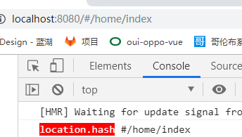

# 在vue-router中hash和history路由的区别

## 一、hash模式及其原理

### 1、简介

​	早期的前端路由的实现就是基于 location.hash 来实现的。其实现原理很简单，location.hash 的值就是 URL 中 # 后面的内容。比如下面这个网站，它的 location.hash 的值为 ‘#/home/index ‘：http://localhost:8080/#/home/index。

​	URL 中 hash 值只是客户端的一种状态，也就是说当向服务器端发出请求时，hash 部分不会被发送。

 	hash 值的改变，都会在浏览器的访问历史中增加一个记录。因此我们能通过浏览器的回退、前进按钮控制hash 的切换。

### 2、hash值的切换方法

#### (1) vue-router

​	<router-link to="/home/index">vue点击跳转home</router-link>

​	<router-link to="/about/index">vue点击跳转about</router-link>

#### (2) a标签

​	<a href="#/home/index">点击跳转home</a>

​	<a href="#/about/index">点击跳转about</a>

#### (3) 通过js对location.hash进行赋值

​	location.hash = "#/home/index"; 

​	location.hash = "#/about/index";

二、history模式及其原理

三、hash和history对比